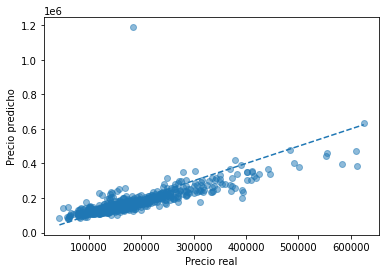

# 🏠 Ames Housing Price Prediction

## 📄 Descripción
Este proyecto consiste en construir un modelo predictivo de precios de viviendas usando el conjunto de datos de Ames (Iowa, EE. UU.). Se aplicaron técnicas de análisis exploratorio, limpieza de datos, ingeniería de características y modelos lineales regularizados para predecir el **precio de venta** de las casas.

---

## 🗂️ Acerca del conjunto de datos
El conjunto de datos de vivienda de Ames es un conjunto ampliamente reconocido en el campo del **aprendizaje automático** y el **análisis de datos**. Contiene diversas características de las viviendas y se utiliza principalmente para tareas de regresión.

- **Número de instancias:** 2.930 observaciones  
- **Número de características:** 79 variables  
- **Variable objetivo:** `SalePrice` (Precio de venta)  
- **Tipos de datos:** Numéricas y categóricas (tamaño del lote, número de habitaciones, ubicación, construcción, etc.)  

Este dataset es ideal para **modelado predictivo, ingeniería de características y análisis de regresión**.

---

## 🧰 Tecnologías y librerías utilizadas
- Python 🐍  
- Pandas, NumPy  
- Matplotlib, Seaborn  
- Scikit-learn (LinearRegression, Lasso, Ridge, preprocessing)  

---

## 🏗️ Flujo de trabajo / Pipeline
1. **EDA (Exploratory Data Analysis)** 🔍  
   - Análisis de distribuciones y outliers  
   - Correlaciones con `SalePrice_log`  
   - Identificación de variables irrelevantes y multicolinealidad  

2. **Limpieza de datos** 🧹  
   - Imputación de valores faltantes (mediana para numéricas, moda para categóricas)  
   - Eliminación de variables redundantes o altamente colineales  

3. **Feature Engineering** 🛠️  
   - Codificación ordinal manual  
   - One-Hot Encoding para variables nominales  
   - Separación clara entre features `X` y target `y`  

4. **Modelado** 🧮  
   - Creación de pipeline completo:  
     ```python
     Pipeline([
         ("preprocessor", preprocessor),
         ("regressor", Model())
     ])
     ```
   - Ventajas: evita data leakage, reproducible, escalable, listo para producción  

---

## 🔜 Resultados principales
- Modelo ganador: **LASSO**  
- TRAIN RMSE (log): 0.1302960671229784  
- TEST RMSE (log): 0.11571793484987468  
- TRAIN R²: 0.8944921714470315  
- TEST R²: 0.9276296145781626  

> 💡 Estas métricas muestran un buen ajuste y capacidad de generalización, pero todavía puedes completarlas con gráficos de residuales y Real vs Predicho.

---

## 📈 Evaluación del modelo 
- Gráfico Real vs Predicho
 
### 🔹 Resumen basado en LASSO
- **TRAIN RMSE (log):** 0.1303  
- **TEST RMSE (log):** 0.1157  
- **TRAIN R²:** 0.8945  
- **TEST R²:** 0.9276  

### 🔹 Observaciones de los residuos
1. **Distribución aproximadamente normal:**  
   - La mayoría de los residuos se concentran alrededor de cero → no hay sesgo sistemático.  

2. **Homoscedasticidad:**  
   - La dispersión es relativamente constante a lo largo de los valores predichos. 

3. **Outliers detectados:**  
   - Algunas viviendas con precios extremos presentan residuos mayores.  
   - Estos casos pueden analizarse individualmente para ver si requieren ajuste.
  
### 🔹 Conclusión
El modelo **LASSO**:
- Tiene buen poder predictivo  
- Generaliza bien a datos nuevos  
- No muestra problemas graves de heteroscedasticidad o sesgo 

---
## 📬 Contacto


Si quieres **conectar**, colaborar o simplemente hablar de data science, ML o proyectos de análisis de datos, ¡escríbeme!  

- **LinkedIn:** [Camilo Pedreros](https://www.linkedin.com/in/camilo-pedreros-106a1a245/) 🔗  
- **Correo:** [cpedreros488@gmail.com](cpedreros488@gmail.com) 📧  
- **GitHub:** [@CamiiloP14](https://github.com/CamiiloP14) 🐱  


